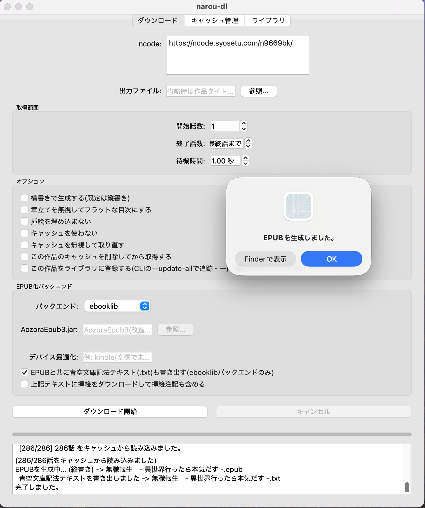
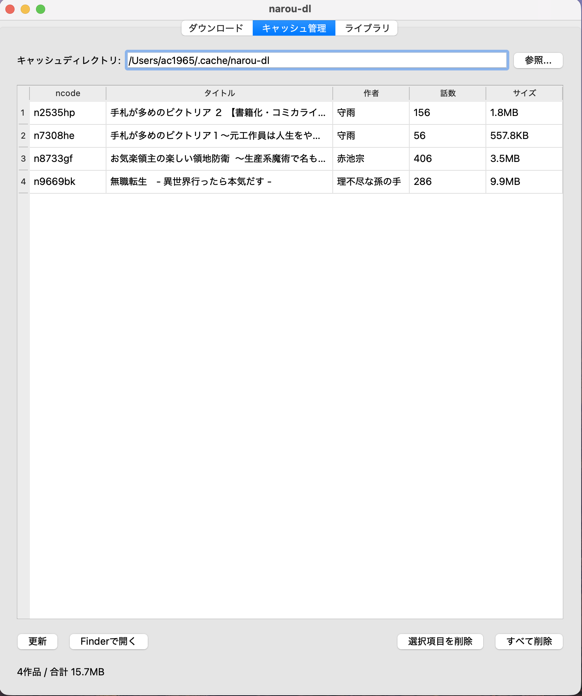
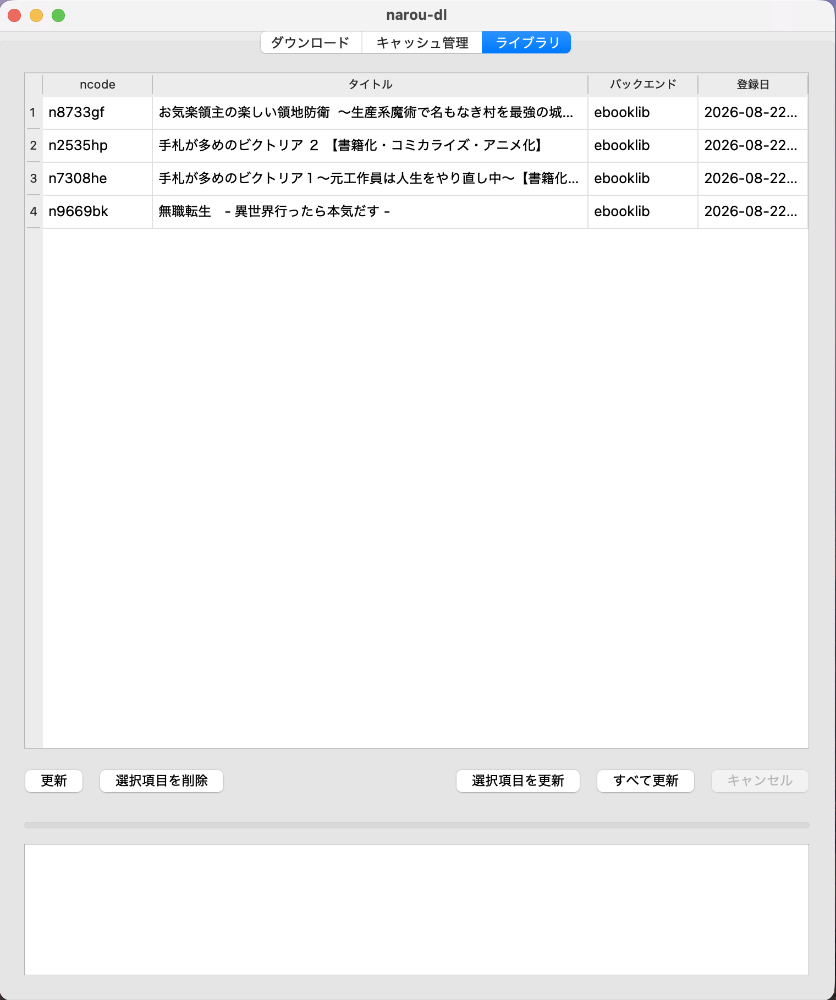

# narou-dl





「小説家になろう」の作品をダウンロードして、EPUB(縦書き/横書き)に変換するツール。
CLI(`narou-dl`)とmacOS用GUI(`narou-dl-gui`)を同じコアロジックで提供する。

- Python 3.10以上
- GUI・`.app`ビルドはmacOS専用(CLI自体はOS非依存)

## クイックスタート

```bash
make setup-cli
.venv/bin/narou-dl N9669BK
```

`N9669BK` の部分はncode(作品コード)。作品URL
(`https://ncode.syosetu.com/n9669bk/`)をそのまま渡してもよい
(大文字・小文字は区別しない)。既定で縦書きEPUBが `作品タイトル.epub` として
カレントディレクトリに出力される。

## Makefile

| コマンド | 内容 |
| --- | --- |
| `make setup-cli` | CLI(`narou-dl`)用の仮想環境 `.venv/` を作りインストールする |
| `make setup-gui` | GUI(`narou-dl-gui`)用の仮想環境 `.venv-gui/` を作りインストールする |
| `make run ARGS='N9669BK --yoko'` | `.venv/`のCLIを実行する |
| `make run-gui` | `.venv-gui/`のGUIを起動する |
| `make app` | macOS用 `dist/narou-dl.app` をビルドする([該当節](#appバンドルのビルドpy2app)参照) |
| `make install-app` | `dist/narou-dl.app` を `/Applications` にインストールする(無ければ先にビルドする) |
| `make uninstall-app` | インストールした `narou-dl.app` を削除する |
| `make install` | `narou-dl`をpyenv等のグローバルなPython環境に直接インストールする(venv不要でどこからでも使える) |
| `make uninstall` | グローバル環境から`narou-dl`をアンインストールする |
| `make test` | pytestでテストスイートを実行する |
| `make clean` | リポジトリ内の一時ファイル(`__pycache__`・各種キャッシュディレクトリ)を削除する |
| `make distclean` | `clean`・`uninstall`に加え仮想環境・ビルド成果物も含めて全て削除する |

`setup-cli`/`setup-gui`/`app`の仮想環境(`.venv/` `.venv-gui/` `.venv-app-build/`)を
分けているのは、それぞれが必要とする依存(特にGUIのPySide6は数百MB)を
混在させないため(開発・テスト向け)。venvをactivateせず普段使いの
シェルからそのまま`narou-dl`を使いたい場合は`make install`を使う。
Makefileを使わず直接インストールする場合は`pip install -e .`(CLI)/
`pip install -e ".[gui]"`(GUI)でも構わない。

## CLIの使い方

### 基本

```bash
narou-dl N9669BK                          # フル取得(縦書き)
narou-dl N9669BK --yoko                   # 横書きで生成
narou-dl N9669BK -o musyoku.epub          # 出力ファイル名を指定(拡張子省略可)
narou-dl N9669BK --sleep 1.5              # 各話取得後の待機秒数を指定(既定1.0秒)
narou-dl N9669BK --start 1 --end 20       # 一部の話だけ取得
narou-dl N9669BK --no-chapters            # 章立てを無視してフラットな目次にする
narou-dl N9669BK --no-images              # 挿絵を埋め込まない
narou-dl N9669BK --reveal                 # 生成後、Finderでファイルを選択状態にする(macOSのみ)
```

ncode の代わりに作品URL(`https://ncode.syosetu.com/n9669bk/`、話ページの
URLでも可)をそのまま指定できる(GUIのncode欄でも同様)。

### キャッシュ

取得した本文・章立て・挿絵は既定でキャッシュディレクトリに保存され、
再ダウンロード時はキャッシュにある話・挿絵をネットワークアクセスなしで
再利用する。キャッシュ利用時は目次から話ごとの最終更新日時を取得し、
なろう側で「改稿」された話だけを自動的に再取得する。

```bash
narou-dl N9669BK --refresh            # キャッシュを無視して取り直す(改稿更新など)
narou-dl N9669BK --clear-cache        # この作品のキャッシュを削除してから取得する
narou-dl N9669BK --no-cache           # キャッシュを使わない
narou-dl N9669BK --no-update-check    # 改稿の自動検知をせず、キャッシュがあれば常に使う
narou-dl N9669BK --cache-dir DIR      # キャッシュの保存先を明示指定する
```

キャッシュディレクトリの決定順序: `--cache-dir` > 環境変数
`XDG_CACHE_HOME`(`$XDG_CACHE_HOME/narou-dl`) > `~/.cache/narou-dl`。
この既定値はカレントディレクトリに依存しないため、CLI・GUI・`.app`
バンドルのどれで起動しても同じキャッシュを共有する。

### 既定オプションの保存(CLI・GUI共有)

`--yoko`・EPUB化バックエンド・待機秒数などの主要オプションは
`~/.config/narou-dl/config.json`(環境変数`XDG_CONFIG_HOME`が設定されて
いれば`$XDG_CONFIG_HOME/narou-dl/config.json`)に保存でき、CLI・GUI
どちらで変更してももう一方に反映される。

```bash
narou-dl --save-config --yoko --backend aozoraepub3 --aozoraepub3-jar /path/to/AozoraEpub3.jar
# ncodeを指定すればダウンロードと同時に保存できる
narou-dl N9669BK --save-config --sleep 2.0
```

設定ファイルの既定値が`true`になっている項目を1回だけ元に戻したい場合は
否定形のオプションを指定する。`--yoko`/`--emit-aozora-txt`/
`--emit-aozora-txt-images`は`--no-yoko`のように`--no-`を付けた形、
`--no-chapters`/`--no-images`はそれぞれ`--chapters`/`--images`
(二重否定`--no-no-chapters`にはしていない)。

### EPUB化バックエンド

既定は `ebooklib`(narou_dl自身がHTMLを直接EPUB化する)。より高度な組版が
必要な場合は `aozoraepub3` を指定する(JRE(Java 21以降推奨)と
`AozoraEpub3.jar`(改造版)が別途必要)。

```bash
# AozoraEpub3(改造版)を外部プロセスとして使う
# (傍点・外字自動判定・縦中横・画像回り込み等、より高度な組版が可能)
narou-dl N9669BK --backend aozoraepub3 --aozoraepub3-jar /path/to/AozoraEpub3.jar
# --aozoraepub3-jar の代わりに環境変数でも指定できる
export AOZORAEPUB3_JAR=~/.local/share/aozoraepub3/AozoraEpub3.jar
narou-dl N9669BK --backend aozoraepub3
narou-dl N9669BK --backend aozoraepub3 --device kindle  # デバイス最適化を指定

# ebooklibでEPUBを生成しつつ、同じ話データから青空文庫記法テキスト(.txt)も書き出す
# (挿絵注記は既定で含めない。--backend aozoraepub3 とは併用不可)
narou-dl N9669BK --emit-aozora-txt
narou-dl N9669BK --emit-aozora-txt --emit-aozora-txt-images  # 挿絵注記も含める
```

### ライブラリ機能

追跡したい作品を登録しておくと、まとめて更新できる
(`<cache_dir>/library.json`に登録時のオプションと共に記憶される)。

```bash
narou-dl N9669BK --library-add     # ダウンロード後、今回のオプションと共に登録する
narou-dl --update-all              # 登録済みの全作品を登録時のオプションで再取得する
narou-dl --library-list            # 登録済みの作品を一覧表示する
narou-dl N9669BK --library-remove  # 登録を削除する(ダウンロードは行わない)
```

`--update-all`は新規話・改稿された話だけをキャッシュの鮮度判定で効率的に
取得するため、日々の巡回チェック用途に向いている(cronやlaunchdから
定期実行することを想定)。

## GUIアプリ(macOS)

CLIと同じダウンロード処理をPySide6製のGUIから使える。

```bash
make setup-gui
make run-gui
```

| 機能 | 内容 |
| --- | --- |
| 一括ダウンロード | ncode欄に1行1件で複数指定すると、順番に自動でダウンロードする(出力ファイル名は各作品とも自動生成)。進捗表示には現在取得中のncodeと、判明次第そのタイトルが添えて表示される |
| キャンセル | ダウンロード中は「キャンセル」ボタンで中断できる(現在取得中の話の完了を待ってから止まる協調的キャンセル)。一括ダウンロード中にキャンセルすると残りのキューも実行されない |
| バックエンド選択 | `ebooklib`(既定)/`aozoraepub3`をGUIから選択できる。`aozoraepub3`選択時は`.jar`パス・デバイス最適化オプションを指定できる。`ebooklib`選択時は`--emit-aozora-txt`相当のオプションも利用できる |
| 設定の保存 | 主要オプション(縦横・バックエンド設定等)は`~/.config/narou-dl/config.json`に保存され、次回起動時に復元される。CLIの`--save-config`と同じファイルを共有するため、どちらで変更してももう一方に反映される(詳細は「CLIの使い方」内の既定オプション保存の節を参照) |
| ライブラリに登録 | ダウンロードタブの「この作品をライブラリに登録する」にチェックすると、CLIの`--library-add`と同様に今回のオプションと共に登録される |
| Finderで表示 | ダウンロード完了ダイアログの「Finderで表示」ボタンから、生成したEPUB(一括ダウンロード時は出力フォルダ)をFinderで開ける |
| キャッシュ管理タブ | `cache.py`が作品ごとに作るキャッシュディレクトリを一覧表示し、作品単位での削除・全削除・Finderで開く操作ができる |
| ライブラリタブ | 登録済み作品を一覧表示(`--library-list`相当)し、選択項目の削除(`--library-remove`相当)、選択項目または全件の更新(`--update-all`相当。登録時のオプションのまま再実行する)ができる |

### .appバンドルのビルド(py2app)

`py2app`で`narou-dl.app`を作れる。PySide6は多数の未使用フレームワーク
(QtWebEngine等)を含むため、素の`py2app`ビルドは1GB超になる。
`scripts/trim_macos_bundle.py`でこのアプリが実際に使うQtモジュールだけに
絞り込み、Qtプラグインの参照先修正・再署名まで行うと約200MBになる。

```bash
make app
open dist/narou-dl.app
```

`/Applications`に置いてFinderやLaunchpadから起動したい場合は
`make install-app`でインストールする(`dist/narou-dl.app`が無ければ先に
`make app`を実行してからインストールする)。

```bash
make install-app                          # /Applications/narou-dl.app にインストール
make install-app INSTALL_DIR=~/Applications  # インストール先を変更する場合
make uninstall-app                        # インストールしたアプリを削除する
```

`make app`は専用の仮想環境`.venv-app-build/`を都度作り直してビルドする
(汚染されていないクリーンな環境でないと、py2appが無関係なパッケージを
巻き込んでサイズ増大や署名エラーの原因になるため)。内部では以下を行っている:

```bash
python3 -m venv .venv-app-build
.venv-app-build/bin/pip install .
.venv-app-build/bin/pip install "PySide6>=6.5" py2app

# setup.py はpy2app専用で、pyproject.tomlの[project]と併存すると
# py2appが依存関係(install_requires)を検出してエラーになるため、
# ビルド中だけ一時的にpyproject.tomlを退避する
mv pyproject.toml pyproject.toml.bak
.venv-app-build/bin/python setup.py py2app
mv pyproject.toml.bak pyproject.toml

.venv-app-build/bin/python scripts/trim_macos_bundle.py dist/narou-dl.app
```

生成物は`dist/narou-dl.app`(中間ファイルは`build/`)。`make distclean`で
`.venv-app-build/`ごと削除できる。

## 仕組み

1. **なろう小説API** (`narou_dl/api.py`) でタイトル・作者・話数などのメタデータを取得
2. **スクレイパー** (`narou_dl/scraper.py`)
   - 各話ページ (`ncode.syosetu.com/{ncode}/{話数}/`) から本文を取得(ルビ`<ruby>`・挿絵``タグは保持)
   - 目次ページ (`ncode.syosetu.com/{ncode}/`) から章立て(「第一章」などの区切り)を取得
3. **EPUB化バックエンド**(`--backend`で選択、既定は`ebooklib`)
   - `ebooklib`(既定・**EPUBビルダー** `narou_dl/epub_builder.py`): narou_dl自身がHTMLを直接EPUB化する
     - 縦書き(既定): `writing-mode: vertical-rl`、右→左ページ送り、数字の縦中横対応
     - 横書き(`--yoko`): 通常の横書きレイアウト
     - 章立てがある作品は章の区切りページを挿入し、目次(EPUB nav)も章でネストする
     - ルビはそのままEPUBへ埋め込まれ、対応リーダーでふりがなとして表示される
     - 挿絵(本文中の画像)は実データをダウンロードしてEPUB内に同梱する(`--no-images`で無効化可能)
     - `--emit-aozora-txt` を指定すると、EPUBと同じ話データから独立して
       (**青空文庫記法変換** `narou_dl/aozora.py`)青空文庫記法テキストも書き出せる
       (`--emit-aozora-txt-images`で挿絵注記も含められる、既定は含めない)
   - `aozoraepub3`: 本文を(**青空文庫記法変換** `narou_dl/aozora.py`)で青空文庫記法テキストに変換し、
     AozoraEpub3(改造版、`narou_dl/aozoraepub3_backend.py`)を外部プロセス起動してEPUB化する。
     傍点・外字自動判定・縦中横・画像の自動回転や余白除去等、より高度な組版が必要な場合に指定する。
     JRE(Java 21以降推奨)と`AozoraEpub3.jar`本体が別途必要(`--aozoraepub3-jar`または環境変数`AOZORAEPUB3_JAR`で指定)
4. **キャッシュ** (`narou_dl/cache.py`)
   - 取得した作品メタデータ・本文・章立て・挿絵をキャッシュディレクトリに保存
   - 同じ作品を再度ダウンロードする際は、キャッシュにある話・挿絵はネットワークアクセスなしで再利用する
   - 章立ては全話数が変わると自動的にキャッシュを無効化する(新しい話が投稿された場合など)
   - `--refresh` でキャッシュを無視して取り直し、`--clear-cache` でキャッシュを削除、`--no-cache` でキャッシュ自体を使わない
5. **ライブラリ** (`narou_dl/library.py`)
   - `--library-add`で登録した作品は、その時点のオプションと共に
     `<cache_dir>/library.json`に記憶される
   - `--update-all`で登録済みの全作品を登録時のオプションのまままとめて
     再取得できる(実際の取得処理自体はキャッシュ機構をそのまま利用するため、
     新規話・改稿された話だけが効率的に取得される)
6. **設定** (`narou_dl/config.py`)
   - 縦横・EPUB化バックエンド・待機秒数などの既定オプションを
     `~/.config/narou-dl/config.json`に保存する
   - CLI(`--save-config`)・GUIのどちらから保存しても同じファイルを読み書きするため、
     設定が食い違わない

## テスト

`scraper.py`(なろうのHTML構造への依存が強く、サイト側の変更で壊れやすい)を
中心に、`cache.py`・`aozora.py`・`epub_builder.py`・`library.py`・`cli.py`の
ユニットテストがある。実際のなろうサイトへは通信せず、固定HTMLやtmp_pathで
完結する。

```bash
make test
```

## 制限事項・今後の拡張余地

- サイトのHTML構造が変更されると `narou_dl/scraper.py` の修正が必要になります
- `--sleep` は既定1秒です。サーバー負荷軽減のため、大量取得時はこれより短くしないことを推奨します
- 章立てのない作品では自動的にフラットな目次になります(`--no-chapters` で明示的に無効化も可能)
- 挿絵のダウンロードに失敗した場合、そのページの画像は取り除かれ、処理は継続します
- キャッシュされた話の本文は、作者が「改稿」で内容を更新しても自動検知はしません。最新の内容が必要な場合は `--refresh` を使ってください

## 利用上の注意

小説家になろうの規約・著作権を尊重し、個人の読書目的での利用にとどめてください。
ダウンロードした作品を再配布することはできません。挿絵の著作権は投稿者(絵師)に帰属します。

## APIドキュメント(Sphinx)

各モジュールのdocstringはSphinx(napoleon拡張によるGoogleスタイル)で
そのままAPIリファレンスとしてビルドできます。

```bash
pip install -e ".[docs]"
sphinx-build -b html docs docs/_build
```

`docs/_build/index.html` をブラウザで開くと閲覧できます。

## ライセンス

個人利用を想定したツールです。ライセンスは利用者の環境に合わせて設定してください。
